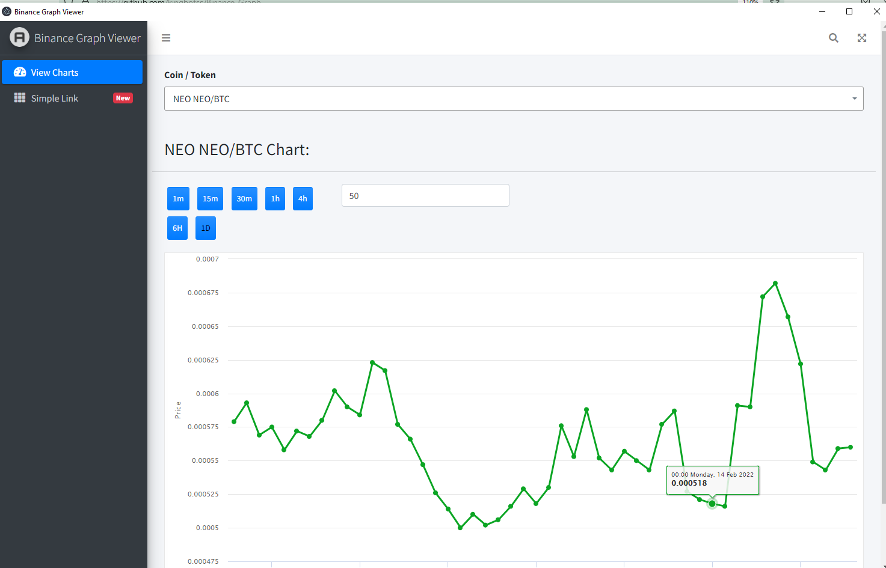

# Binance Graph Viewer for desktop

Binance Graph Desktop Viewer

This project is designed to view binance graph on my desktop without login to the app in mobile or website. all Pairs of graphs supported.
    * Supports All Fairs
    * Points Support Upto 1000
    * Multiple symbols
    * Onchage Events added..


## Pre-requisites
windows 10 or supported version for electron 16+

### Install NodeJS

Install NodeJS from [https://nodejs.org/en/](https://nodejs.org/en/)

### Install Electron Forge

Install Electron forge using the following command

```bash
npm install 
```

## Cloning the Code

Clone the Code using the following command

```bash
git clone https://github.com/kingbotss/Binance-Graph.git
```

## Running the application

Go into the project folder and run the application using the following commands

```bash
cd Binance-Graph
npm install
npm start
```

## Package the Application

The application can be packaged using the command 

```bash
npm run package
```
